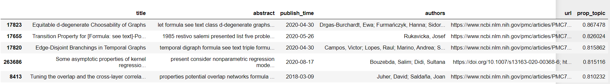

In response to the COVID-19 pandemic, the White House and a coalition of leading research groups have prepared the COVID-19 Open Research Dataset (CORD-19). CORD-19 is a resource of over 300,000 scholarly articles (by 2021 April), about COVID-19, SARS-CoV-2, and related coronaviruses. This freely available dataset is provided to the global research community to apply recent advances in natural language processing and other AI techniques to generate new insights in support of the ongoing fight against this infectious disease. There is a growing urgency for these approaches because of the rapid acceleration in new coronavirus literature, making it difficult for the medical research community to keep up.


**The goal of this project is to reveal the topics from the massive amount of papers, and build a program that allows the user to search article title, then returns the most relevant research papers (along with their confidence score) from the dataset.** 


**Analysis Pathway:**

1. EDA & Data Preprocessing
2. Modeling approach 1: TF-IDF + PCA to create features -> K-means to find clusters -> Most frequent words on each cluster to reveal topics
3. Modeling approach 2: Topic Model directly used on the whole dataset, topic model experimented:
   1. Latent Dirichlet Allocation (LDA)
   2. (HDP)
4. Performance Evaluation
5. Presenting results


## Exploratory Data Analysis

Link for EDA: https://georgehua.github.io/covid19-research-paper-topic-modeling/EDA

Key Takeaways:

- The dataset contains duplicates and missing abstract, need to be cleaned first
- In 2020, the medical paper around the pandemic increase exponentially (more than 250,000) compare to 2019 (less than 25,000)

- Dataset total entries: 536,817
- After remove duplicates and missing abstract paper: 344,711
- English papers kept for further modeling: **338,442**


From the word cloud generated above, we start to see some levels of research directions in the papers:

- Covid, cov, coronavirus, sar
- Virus, infection, cell, protein, treatment (virus study)
- Mortality, death (death rate study)
- Respiratory, age, lung, blood, protein, risk (risk factor study and impact analysis)


## Walk Through the Project


### 1. Dataset

```
kaggle datasets download -d allen-institute-for-ai/CORD-19-research-challenge -f metadata.csv

unzip metadata.csv.zip -d data/
```

Instruction about how to use Kaggle API: https://www.kaggle.com/docs/api

Or you can download the dataset manually from: https://www.kaggle.com/allen-institute-for-ai/CORD-19-research-challenge?select=metadata.csv, then store metadata.csv into data/ folder.

```
Data columns (total 19 columns):
 #   Column            Non-Null Count   Dtype  
---  ------            --------------   -----  
 0   cord_uid          536817 non-null  object 
 1   sha               180066 non-null  object 
 2   source_x          536817 non-null  object 
 3   title             536570 non-null  object 
 4   doi               295050 non-null  object 
 5   pmcid             191123 non-null  object 
 6   pubmed_id         254917 non-null  object 
 7   license           536817 non-null  object 
 8   abstract          390379 non-null  object 
 9   publish_time      536598 non-null  object 
 10  authors           522082 non-null  object 
 11  journal           501591 non-null  object 
 12  mag_id            0 non-null       float64
 13  who_covidence_id  222762 non-null  object 
 14  arxiv_id          6996 non-null    object 
 15  pdf_json_files    180066 non-null  object 
 16  pmc_json_files    147047 non-null  object 
 17  url               315683 non-null  object 
 18  s2_id             488029 non-null  float64
```


### 2. Data Preprocessing

```
python src/preproc.py -i <INPUT_FILE_NAME> -dir <DATA_DIRECTORY>

# arg -i and -dir has default values, you can just run
python src/preproc.py
```

The program perform the following preprocessing tasks for the dataset:

Data Cleaning:

- Drop NA
- Drop duplicates
- Drop all non-English research paper
- Remove HTML tags & replace HTML character codes with ASCII equivalent
- Remove URLs, new line and line breaks characters and punctuations
- Replace extra white spaces with one space

Features:

- Lemmatization
- Tokenize each paper's abstract text into a list of words
- Add Bi-gram and Tri-gram to the list of words
- Defined and remove stop words and the words with only 2 letters or less
- Save tokenized list of words into `data/docs.npy` and `data/df_cleaned.csv` for topic modeling


### 3. Modeling


**Approach 1: K-Means:** (Notebook Link: https://georgehua.github.io/covid19-research-paper-topic-modeling/K-Means)

- Turn each document instance into a feature vector using Term Frequency–inverse Document Frequency (TF-IDF).
- Apply Dimensionality Reduction to each feature vector using t-Distributed Stochastic Neighbor Embedding (t-SNE) to cluster similar research articles in the two dimensional plane embedding.
- Use Principal Component Analysis (PCA) to project down the dimensions to a number of dimensions that will keep .95 variance while removing noise and outliers in embedding.
- Apply k-means clustering, where k is 20, to label each cluster on.
- Find the most frequent words in the cluster as the topic of the cluster.
- Investigate the clusters visually on the plot, zooming down to specific articles as needed, and via classification using Stochastic Gradient Descent (SGD). 


By applying K-means, we use elbow method to estimate the optimal number of clusters.  we can see in the plot above that the decline of the sum of squared errors (or distortion) becomes considerably less after k=17. Since the turning point is at k = 17, we will use 17 as the number of clusters for the KMeans model below.

</img>

The K-means generate most frequent words for each cluster

```
Cluster 1
acute, virus, severe, syndrome, respiratory, infection, covid, coronavirus, sars, cov

Cluster 2
admission, icu, clinical, risk, severe, disease, hospital, mortality, covid, patients

Cluster 3
cell, cells, host, replication, binding, virus, viral, rna, proteins, protein

Cluster 4
practice, services, patient, medical, health, healthcare, patients, pandemic, covid, care

Cluster 5
spread, model, crisis, distancing, measures, economic, countries, pandemic, covid, social

Cluster 6
impact, india, health, march, measures, air, pandemic, period, covid, lockdown

Cluster 7
resection, performed, technique, operative, complications, postoperative, surgical, patients, laparoscopic, surgery

Cluster 8
covid, protease, activity, inhibitors, cov, sars, antiviral, compounds, drugs, drug

Cluster 9
method, disease, models, analysis, different, new, time, research, data, model

Cluster 10
sensitivity, test, positive, testing, detection, sars, cov, samples, rt, pcr

Cluster 11
trial, stroke, therapy, risk, trials, patient, studies, clinical, treatment, patients

Cluster 12
case, pandemic, acute, infection, respiratory, severe, coronavirus, disease, patients, covid

Cluster 13
adults, disease, parents, age, infection, years, pediatric, respiratory, covid, children

Cluster 14
pathogens, detected, infection, human, infections, viral, respiratory, viruses, virus, influenza

Cluster 15
inflammatory, ifn, induced, infection, il, mice, immune, expression, cell, cells

Cluster 16
university, pandemic, covid, medical, student, teaching, online, education, learning, students

Cluster 17
care, stress, depression, psychological, pandemic, anxiety, public, mental, covid, health
```

____________________

**Approach 2 Topic Models Only:**

(Notebook Link for LDA:) https://georgehua.github.io/covid19-research-paper-topic-modeling/LDA

(Notebook Link for HDP:) https://georgehua.github.io/covid19-research-paper-topic-modeling/HDP

- Apply topic models on the whole document sets
- Evaluate with Coherence score
- Visualize topics
- Build a function that research dataset with user query (paper title), then returns most related papers based on confidence score.


**Short Introduction and comparison of the 3 topic models: (LDA, HDP)**

The LDA model is guided by two principles:

- Each document is a mixture of topics. In a 3 topic model we could assert that a document is 70% about topic A, 30 about topic B, and 0% about topic C.
- Every topic is a mixture of words. A topic is considered a probabilistic distribution over multiple words.

</img>

HDP is an extension of LDA, designed to address the case where the number of mixture components (the number of "topics" in document-modeling terms) is not known a priori. For HDP (applied to document modeling), one also uses a Dirichlet process to capture the uncertainty in the number of topics. So a common base distribution is selected which represents the countably-infinite set of possible topics for the corpus, and then the finite distribution of topics for each document is sampled from this base distribution.

As far as pros and cons, HDP has the advantage that the maximum number of topics can be unbounded and learned from the data rather than specified in advance. Though it is more complicated to implement, and unnecessary in the case where a bounded number of topics is acceptable.


### 4. Evaluation


**K-means cluster verify with SGD classifier: accuracy: 0.90**

K-means is fast to run and provide a "hard cluster" among the dataset, but our goal is to create a navigation system that allows the users to search and find similar articles. K-means, in this case, cannot fulfill the mission. 


Since topic Modeling is unsupervised, accuracy score is not  applicable for evaluating the model. Instead, we look at the coherence  score, which is an statistical measure of the topic model performance. A topic has a higher score of coherence if the words defining a topic  have a high probability of co-occurring cross documents.

**LDA: 0.58686**

**HDP: 0.3932**

- Topic Coherence measures score a single topic by measuring the degree of semantic similarity between high scoring words in the topic.
- C_v measure is based on a sliding window, one-set segmentation of the top words and an indirect confirmation measure that uses normalized pointwise mutual information (NPMI) and the cosine similarity
- LDA outperforms in this instance


### 5. Topic Results & Interpretation


LDA Topic Viz with pyLDAvis:


LDA top 7 keywords for each topic:


Example output for searching the title: "Logistics of community smallpox control through contact tracing and ring vaccination: a stochastic network model"


Topic 4 key words (rank in order): model, data, analysis, models, time, different, learning, information, show, abstract




### 6. Next Step

- Build a graphical interface to allow better user experience to interact with the program

- Implement a search engine to allow user search keywords instead of the whole paper title


## Project Structure


    ├── README.md          <- The top-level README for developers using this project.
    ├── data
    │   ├── metadata.csv   <- Data source
    │   ├── df_cleaned.csv <- Preprocessed data file
    │
    ├── docs               <- Github Pages documents
    |
    ├── figures            <- Markdown figures
    │
    │
    ├── notebooks          <- Jupyter notebooks for EDA and experiments
    │
    ├── requirements.txt   <- The requirements file for reproducing the analysis environment, e.g.
    │                         generated with `pip freeze > requirements.txt`
    │
    ├── src                <- Source code for use in this project.
    │   │
    │   ├── preproc.py     <- Script for preprocessing data


## Reference

https://towardsdatascience.com/evaluate-topic-model-in-python-latent-dirichlet-allocation-lda-7d57484bb5d0

https://www.kaggle.com/allen-institute-for-ai/CORD-19-research-challenge/code?datasetId=551982&sortBy=voteCount


Great article about visualizing topic modeling results: https://www.machinelearningplus.com/nlp/topic-modeling-visualization-how-to-present-results-lda-models/